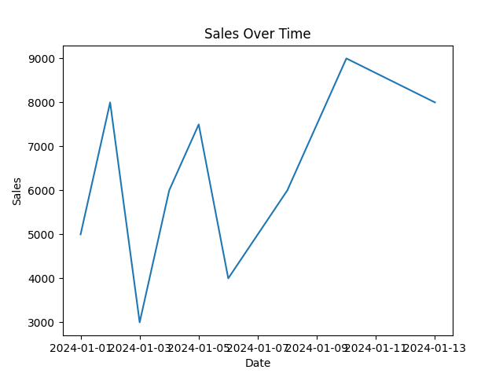
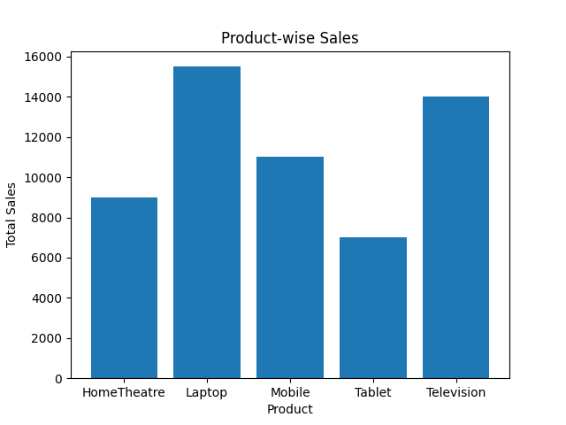
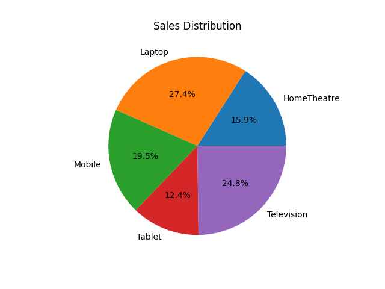

# Sales Data Visualization

This project visualizes sales data using Python.

## Tools Used
- Python
- Pandas
- Matplotlib

## Visualizations
- Line chart (Sales over time)
- Bar chart (Product sales)
- Pie chart (Sales share)
   ## 📊 Output Screenshots

### Sales Over Time (Line Chart)

### Product-wise Sales (Bar Chart)

### Sales Distribution (Pie Chart)

